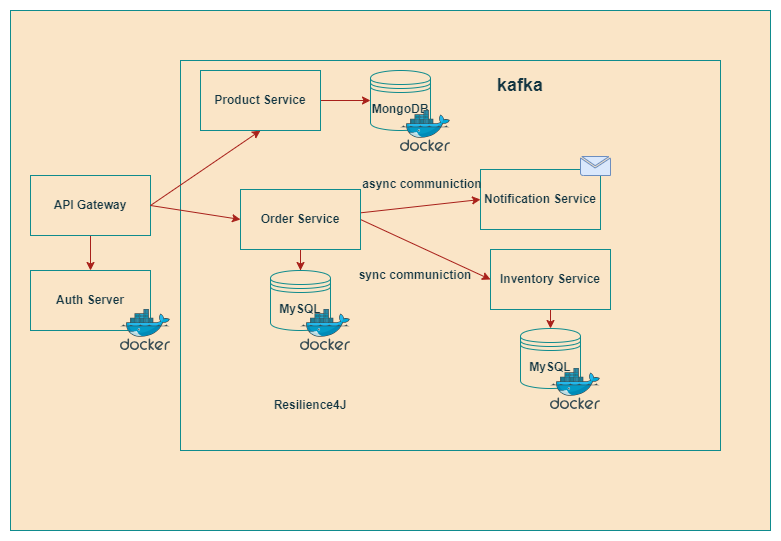

# Microservices Architecture Project

This project demonstrates a modern microservices architecture where each service is responsible for a specific domain. The application includes various services such as an API Gateway, Product Service, Order Service, Inventory Service, Notification Service, and a React-based client application. The project also utilizes Docker, Keycloak for authentication, and several other tools for monitoring, messaging, and database management.

## Project Overview

This project follows a microservices architecture where each service is independently deployable and can communicate with others. The main components of the application are:

- **API Gateway**: Acts as the entry point for all client requests and routes them to the appropriate microservices.
- **Product Service**: Manages product-related data.
- **Order Service**: Handles customer orders and integrates with the Notification Service for sending alerts.
- **Inventory Service**: Tracks product availability and stock levels.
- **Notification Service**: Sends notifications to customers, triggered by events from the Order Service.
- **Client App**: A React-based frontend application that interacts with the microservices via the API Gateway.

## Architecture

The architecture is designed using the microservices pattern, with each service being independently deployable and responsible for a single domain.

  <!-- Replace with your architecture diagram link -->

## Tech Stack

- **API Gateway**: Acts as the central point of entry for all client requests.
- **Product Service**: Handles product-related operations.
- **Order Service**: Manages customer orders.
- **Inventory Service**: Manages product inventory.
- **Notification Service**: Sends notifications to users.
- **React (Client)**: The frontend application built with React.js.
- **Docker**: Containerization of services for easy deployment.
- **Keycloak**: Authentication and authorization for the services.
- **Grafana**: For visualizing metrics and logs.
- **Prometheus**: Used to collect metrics from microservices for monitoring.
- **Loki**: A log aggregation system for logging and monitoring.
- **Testcontainers**: For spinning up test containers in integration testing.
- **Kafka**: Messaging broker for asynchronous communication between services.
- **MySQL**: Relational database for storing product and order information.
- **MongoDB**: NoSQL database for storing inventory data.
- **Mailtrap**: Used for testing email notifications during development.
- **Swagger**: API documentation and testing interface.

